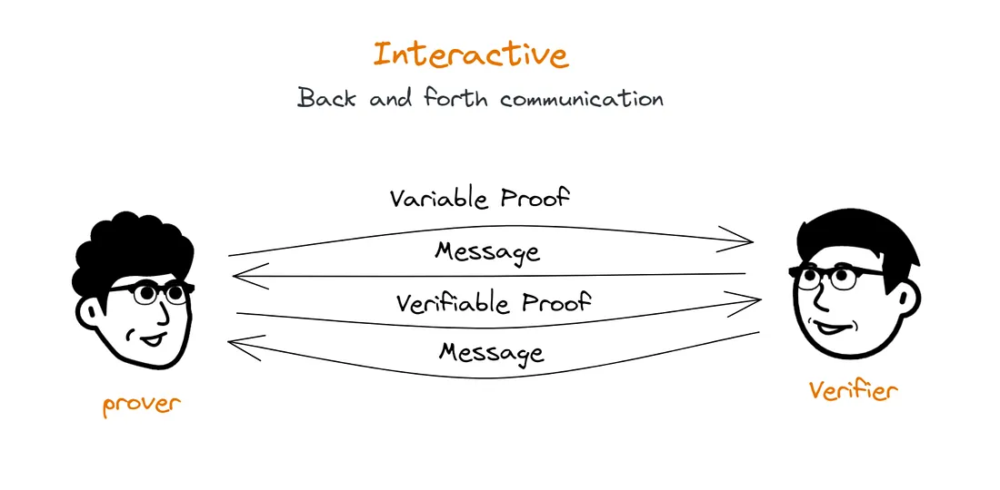
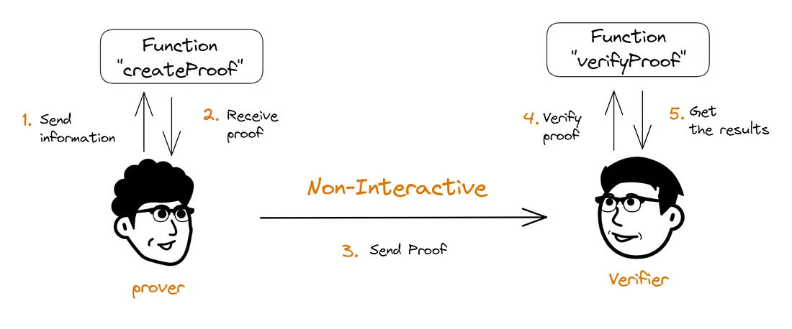

## Fiat-Shamir heuristic Protocol
## Table of Contents

1. [Background](#background)
   - [Introduction](#introduction)
   - [Overview](#overview)
   - [Suitability of Fiat-Shamir Hash Functions in Various Protocols](#suitability-of-fiat-shamir-hash-functions-in-various-protocols)
   
2. [Usage](#usage)
   - [Fiat-Shamir Protocol CLI](#fiat-shamir-protocol-cli)
   - [Output](#output)

3. [References](#references)

## Background

### Introduction
A cryptographic protocol is a distributed algorithm describing precisely the interactions between two or more entities, achieving certain security objectives.

There are basically two forms of authentication schemes: interactive authentication schemes (e.g., identification schemes) and noninteractive authentication schemes (e.g., digital signature schemes). Likewise, zero-knowledge proof schemes may be interactive or noninteractive proof schemes. 

An interactive proof scheme involves a protocol where a prover convinces a verifier of a statement's truth.


<div style ="text-align: center; padding-bottom: 10px; margin-top: -10px">Figure 1: Interactive zero-knowledge proofs (Momin, 2023)</div>

A noninteractive proof scheme includes algorithms for a prover to generate a proof and a verifier to verify it, ensuring confidentiality. The prover proves knowledge of a secret to the verifier without disclosing it, ensuring that the verifier only learns whether the prover has the secret or not.


<div style ="text-align: center; padding-bottom: 10px; margin-top: -10px">Figure 2: Non-interactive zero-knowledge proofs (Momin, K. 2023)</div>

A unique feature of a noninteractive Σ-proof is its ability for any entity to act as the verifier. This means that multiple entities can independently verify the proof, similar to how anyone interested in its validity can verify a digital signature.

The Fiat–Shamir heuristic simplifies Σ-protocols into noninteractive forms, enabling practical zero-knowledge identification.

### Overview
Verification of Alice by Bob can be done in three steps shown below.
Here's an explanation of the Fiat-Shamir protocol steps using the provided code:

1. **Initialization**:
   - The protocol starts with the generation of two large prime numbers, `p` and `q`.
   - These primes are used to calculate the value of `n = p × q`.
   - Additionally, a secret number `s` is chosen between 1 and `n-1`.
   - `s` is then used to calculate `v = s mod n`, where `v` becomes the public key.

2. **Proof Generation (Prover)**:
   - The prover (Alice) generates a non-interactive proof of knowledge using the Fiat-Shamir heuristic.
   - It selects a random number `v` within the group of order `p`.
   - Then, it calculates the value of `x = v² mod n`, where `x` is referred to as the witness.
   - Next, the prover concatenates the byte representations of `p`, `q`, and `x`, and hashes them using a suitable hash function, SHA256 is used here to obtain a challenge `c`.
   - The prover calculates `r = c × x − v mod (p-1)`, which represents the response.

3. **Proof Verification (Verifier)**:
   - The verifier receives `x` and the proof `(c, r)` from the prover.
   - It calculates the left-hand side (LHS) of the Fiat-Shamir equation as `p^r mod n`.
   - It calculates the right-hand side (RHS) of the Fiat-Shamir equation as `q^c mod n`.
   - The verifier checks if the product of the LHS and RHS equals `x`.
   - If the equality holds, the verifier accepts the proof; otherwise, it rejects it.

 


### Suitability of Fiat-Shamir Hash Functions in Various Protocols
Fiat Shamir is sound when using  a Random Oracle model (and ZK for some suitable definitions) but totally broken using any instantiation. It sometimes require a cryptographic hash function. For certain protocols such as Lyubashevsky, Schnorr, Chaum-Pedersen simple FS hash functions can be enough. But for many classic protocols such as GMR85, Blum86 and GMW86 cryptographic FS hash functions are imperative.

## Usage
### Fiat-Shamir Protocol CLI

This CLI tool implements the Fiat-Shamir protocol, a non-interactive proof of knowledge scheme. It allows users to generate and verify proofs for a given message.

**Example:**
```bash
fiat-shamir prove --message "I know a password"
```

- `--message 'string'`: The message for which the proof will be generated. If not provided, the tool will prompt the user to enter the message interactively:


```bash
fiat-shamir prove
```

You will be prompted to enter the message interactively:

```bash
Enter message: <type your message here>
```

### Output

The tool will print the generated proof, including the witness (`x`), response (`r`), challenge (`c`), and other parameters (`p`, `q`). It then verifies the proof and outputs whether the verification succeeded or failed.

### References
1. Schoenmakers, B. (2024, February 2). Lecture Notes Cryptographic Protocols. https://www.win.tue.nl/~berry/CryptographicProtocols/LectureNotes.pdf.

2. U. Feige, A. Fiat, and A. Shamir. Zero-knowledge proofs of identity. Journal of Cryptology, 1(2):77–94, 1988.

3. Maurya, Amit & Choudhary, Murari & P, Ajeyaraj & Singh, Sanjay. (2012). Modeling and Verification of Fiat-Shamir Zero Knowledge Authentication Protocol. 10.1007/978-3-642-27308-7_6.

4. Forouzan, B.A.: Cryptography & Network Security. First edn. McGraw-Hill Press, 
United Kingdom (2008)

5. Momin, K. (2023, April 4). A Non-Mathematical introduction to zero knowledge proof. Medium. Retrieved March 27, 2024, from https://kayprasla.medium.com/a-non-mathematical-introduction-to-zero-knowledge-proof-c1a4a269e308

6. Wikipedia contributors. (2024, February 29). Random oracle. Wikipedia. https://en.wikipedia.org/wiki/Random_oracle

---
© 2024 Omoniyi Caleb <calebomoniyitomiwa@gmail.com>