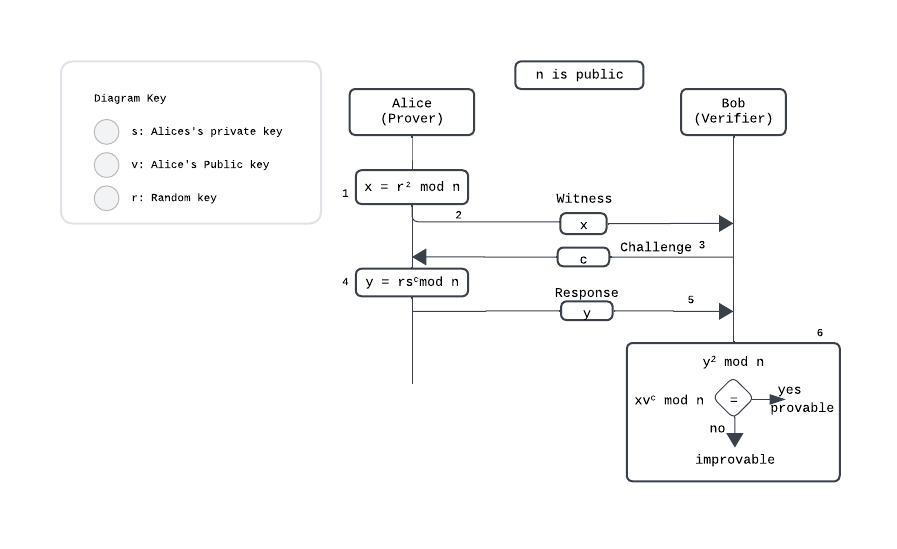

## Fiat-Shamir heuristic Protocol

### Introduction
A cryptographic protocol is a distributed algorithm describing precisely the interactions between two or more entities, achieving certain security objectives.

There are basically two forms of authentication schemes: interactive authentication schemes (e.g., identification schemes) and noninteractive authentication schemes (e.g., digital signature schemes). Similarly, one may distinguish two forms of zero-knowledge proof schemes: interactive proof schemes and noninteractive proof schemes. 

An interactive proof scheme comprises a protocol by which a prover convinces a verifier that a certain statement holds. A noninteractive (zero-knowledge) proof scheme comprises an algorithm by which a prover generates a proof for a certain statement and another algorithm by which a verifier may verify a given proof. The prover does not reveal anything that might cause danger to the confidentiality of the secret. The prover proves to the verifier that she knows a secret, without revealing it. The interactions are so designed that the the verifier only knows that the prover does or does not have the secret, nothing more.

A distinctive feature of a noninteractive Σ-proof is that any entity may play the role of the verifier. As a consequence, a noninteractive Σ-proof can be verified independently by many entities—just as a digital signature can be verified by anyone who is interested in its validity.

The Fiat–Shamir heuristic is a practical scheme for zero-knowledge identification and a simple but effective way to make any Σ-protocol noninteractive.

### Overview
In the Fiat-Shamir protocol, a trusted third party chooses two large prime
numbers `p` and `q` to calculate the value of `n = p × q`. The value of `n` is disclosed to the public while the values of `p` and `q` are kept secret. Alice the prover, selects a secret number `s` between 1 and n-1 i.e., `(1 ≤ s <n)`. She calculates `v = s mod n`. She keeps `s` as her private key and registers `v` as her public key with the third party. 

Verification of Alice by Bob can be done in four steps shown below:
1. Alice, the claimant, chooses a random number `r` between 0 and n-1 i.e., `(1 ≤ r <n)`. She then calculates the value of `x = r² mod n`; `x` is called as witness.
2. Alice sends `x` to Bob as the witness.
3. Bob the verifier, sends a challenge `c` to Alice, `c` is either 0 or 1.
4. Alice calculates the response <code>rsc</code>, where `r` is a random number selected by Alice in the first step. `s` is her private key and `c` is the challenge(0 or 1).
5. Alice sends the response to Bob to show that she knows value of her private
key, s. She claims to be Alice.
6. Bob calculates <code>xvc</code>. If these two values are equal then Alice
either knows the value of s (she is honest) or she has calculated the value of
`y` in some other way (dishonest) because we can easily prove that y² is the same as xvc in the modulo n arithmetic as given below:
<code>
y² = (rs)c = r²s²c = r²(s²)c = xvc
</code>

 

### References
1. Schoenmakers, B. (2024, February 2). Lecture Notes Cryptographic Protocols. https://www.win.tue.nl/~berry/CryptographicProtocols/LectureNotes.pdf.

2. U. Feige, A. Fiat, and A. Shamir. Zero-knowledge proofs of identity. Journal of Cryptology, 1(2):77–94, 1988.

3. Maurya, Amit & Choudhary, Murari & P, Ajeyaraj & Singh, Sanjay. (2012). Modeling and Verification of Fiat-Shamir Zero Knowledge Authentication Protocol. 10.1007/978-3-642-27308-7_6.

4. Forouzan, B.A.: Cryptography & Network Security. First edn. McGraw-Hill Press, 
United Kingdom (2008)